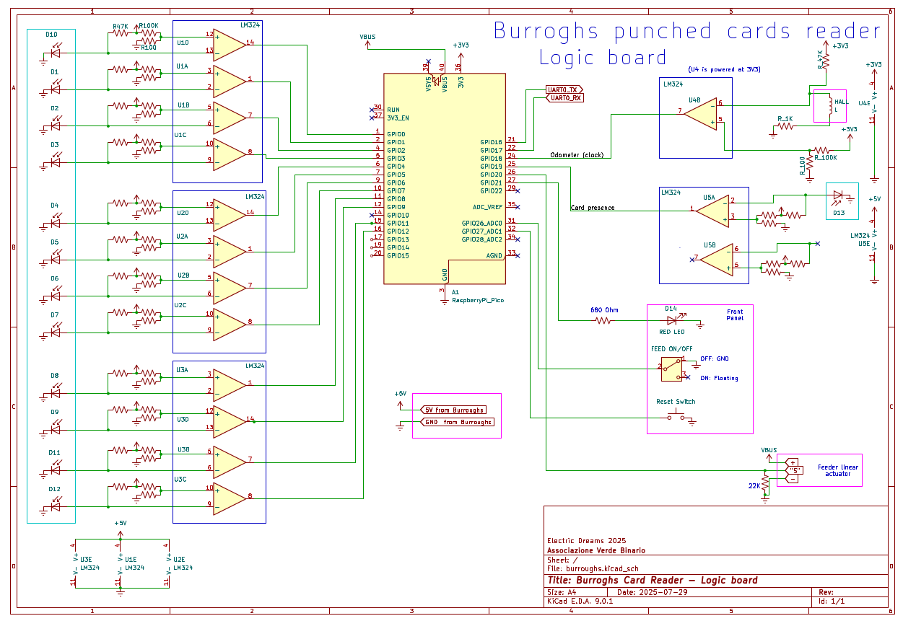

# Burroughs Punched Card Reader Restoration

This project documents the restoration of a vintage **Burroughs punched card reader** by interfacing it with a **Raspberry Pi Pico** using custom circuitry and firmware. The goal is to non-destructively digitize standard IBM 80-column punch cards and make the device usable with modern systems.

---

## 🧠 Overview

The Burroughs reader uses **optical sensors** to detect holes in a punch card as it passes over a light path. Analog outputs from these sensors are conditioned by op-amps (LM324) and fed to the Raspberry Pi Pico's GPIOs.

The Pico:
- Detects card presence and movement via the **card detect** and **odometer** lines
- Samples data from the sensors at precise intervals
- Buffers and displays punch card contents
- Controls a **feeder motor** to move cards automatically
- Exposes reset and feed control via physical switches

---

## 🔌 Hardware Integration

### Inputs to the Pico

| Signal Name     | GPIO | Purpose                     |
|-----------------|------|-----------------------------|
| D0–D12          | 0–9, 11, 12 | Punch card data bits (12 bits) |
| Odometer (Clock)| 18   | Pulses during card feed to time samples |
| Card Presence   | 19   | Low = card inserted         |
| Feed Switch     | 26   | Toggles automatic feed      |
| Reset Button    | 27   | Triggers a full system reboot |

### Outputs from the Pico

| GPIO | Signal      | Description                      |
|------|-------------|----------------------------------|
| 20   | Feeder Pulse| Pulses the card feeder motor     |
| 21   | LED (Red)   | Optional status indicator        |

### Analog Front-End

Each sensor LED pair is connected to a photodiode, buffered by an LM324 op-amp configured as a comparator. The output is digital (3.3V logic) and connected directly to the Pico’s GPIOs.

---

## ⚙️ Firmware Logic

The firmware is written in C using the **Pico SDK**.

### Key Concepts

- **Sampling** is triggered by a rising edge on the odometer signal.
- Sampling is delayed initially (`START_COUNT = 4` pulses) before reading the first column.
- Each column is sampled every `COLUMN_READ_COUNT = 8` odometer ticks.
- A card consists of **80 columns**, each with up to 13 punch positions.
- `BITMASK` (`0x1BFF`) masks out the relevant GPIO bits.
- If odometer pulses exceed `TOO_MANY_CLOCKS` (700), a warning is issued.

### Dual-Core Operation

- **Core 0** handles all IRQs, data sampling, and user interaction.
- **Core 1** monitors the feed switch and toggles the **feeder motor**.

### Interrupt Handlers

- **Card Detect (GPIO 19)**:
  - Falling edge → start of a card
  - Rising edge → end of card
- **Odometer (GPIO 18)**:
  - Increments `jiffies` (clock counter)
  - Triggers sampling logic
- **Reset Button (GPIO 27)**:
  - Triggers a soft reboot via the ARM AIRCR register

---

## ⌨️ Terminal Controls

- Press `' '` (spacebar) → Visual dump of card columns (`*` = punched, `_` = blank)
- Press `'a'` → Raw hexadecimal output for each column
- Press `'e'` (if enabled) → EBCDIC-decoded stream

---

## 🛠️ Restoration Steps

1. **Verified sensor outputs** and rebuilt the logic board.
2. **Designed the logic interface** to match 3.3V GPIO of the Pico.
3. **Created the firmware** with sampling and timing control.
4. **Added physical controls** for feed and reset.
5. **Implemented dual-core handling** for motor and main loop separation.
6. **Tested punch card reading** using real cards and visual/hex output.

---

## ⧉ Files

- `burroughs.kicad_sch` - Logic schematic (see image)
- `main.c` - Complete firmware code for Raspberry Pi Pico
- `README.md` - This file
- `CMakeList.txt` 

---

## 📷 Schematic Overview



---

## 🧪 Example Output

```
Card n. 1
*_*__*__...    ← Top punch row
*____*___...   ← Zone punches
**_***__*...   ← Rows 0–9
...
```

---

## 🧠 Future Improvements

- Full **EBCDIC decoding** table
- Add optional direct UART communication (instead of USB) via UART0

---

## 👥 Contributors

- Made during "Electric Dreams 2025" by Associazione Verde Binario 


